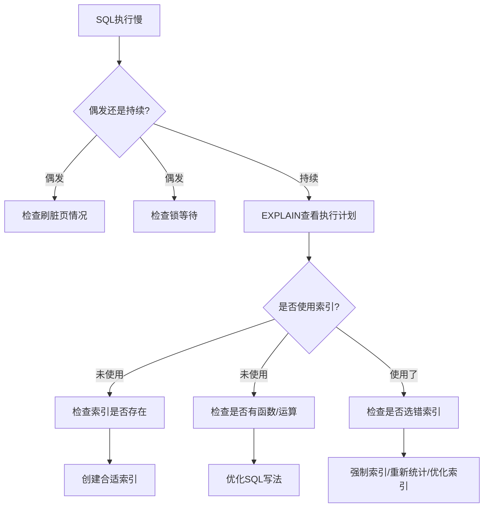

# SQL语句执行慢的原因分析与优化指南

> 腾讯面试经典问题：一条SQL语句执行得很慢的原因有哪些?

## 概述

当遇到SQL执行缓慢的问题时,需要根据具体场景分类分析。本文将从两个维度深入探讨SQL执行慢的原因及解决方案。

---

## 一、偶发性执行慢

### 场景描述
大多数情况下SQL执行正常,但偶尔会出现执行缓慢的情况。

### 1.1 数据库刷新脏页(Flush)

脏页是指内存中被修改过但还未同步到磁盘的数据页。以下情况会触发脏页刷新:

#### 触发场景

| 场景 | 说明 | 影响程度 |
|------|------|---------|
| **redo log写满** | 日志文件写满后,必须暂停所有更新操作,强制将脏页刷到磁盘 | ⚠️ 高 |
| **内存不足** | Buffer Pool满时需要淘汰数据页,如果淘汰的是脏页则需先刷盘 | ⚠️ 中 |
| **系统空闲时** | MySQL认为系统负载低时,会主动进行脏页刷新 | ✅ 低 |
| **正常关闭** | MySQL shutdown时会将所有脏页刷新到磁盘 | ✅ 低 |

#### 优化建议

```sql
-- 查看脏页比例
SHOW STATUS LIKE 'Innodb_buffer_pool_pages_dirty';
SHOW STATUS LIKE 'Innodb_buffer_pool_pages_total';

-- 调整刷新策略参数
SET GLOBAL innodb_max_dirty_pages_pct = 75;  -- 脏页比例阈值
SET GLOBAL innodb_io_capacity = 2000;        -- IO能力配置
```

### 1.2 锁等待

SQL执行时遇到锁冲突,需要等待其他事务释放锁。

#### 常见锁类型

**表锁**
- 整张表被锁定,粒度大,并发性能差
- 常见于MyISAM引擎或显式使用`LOCK TABLES`

**行锁**
- InnoDB默认锁机制,锁定具体行记录
- 并发性能好,但可能产生死锁

#### 排查方法

```sql
-- 查看当前锁等待情况
SELECT * FROM information_schema.INNODB_LOCKS;
SELECT * FROM information_schema.INNODB_LOCK_WAITS;

-- 查看正在执行的事务
SELECT * FROM information_schema.INNODB_TRX;

-- 查看锁等待超时设置
SHOW VARIABLES LIKE 'innodb_lock_wait_timeout';
```

#### 解决方案

1. 优化事务逻辑,减少事务执行时间
2. 合理设计锁粒度,避免大范围加锁
3. 调整锁等待超时参数
4. 必要时手动kill阻塞的事务

---

## 二、持续性执行慢

### 场景描述
在数据量不变的情况下,SQL一直执行缓慢。

### 2.1 未使用索引

#### 情况1: 字段没有索引

**现象:** 全表扫描(type = ALL)

```sql
-- 错误示例:没有索引
SELECT * FROM users WHERE age = 25;

-- 优化:创建索引
CREATE INDEX idx_age ON users(age);
```

#### 情况2: 字段有索引但未使用

##### (1) 对索引字段进行左值运算

```sql
-- ❌ 错误:索引失效
SELECT * FROM orders WHERE price - 100 = 900;
SELECT * FROM orders WHERE price / 2 = 500;

-- ✅ 正确:移动运算到右侧
SELECT * FROM orders WHERE price = 900 + 100;
SELECT * FROM orders WHERE price = 500 * 2;
```

##### (2) 对索引字段进行函数操作

```sql
-- ❌ 错误:函数导致索引失效
SELECT * FROM products WHERE POW(quantity, 2) = 1000;
SELECT * FROM users WHERE YEAR(create_time) = 2024;
SELECT * FROM users WHERE UPPER(name) = 'JOHN';

-- ✅ 正确:避免函数包裹索引列
SELECT * FROM products WHERE quantity = SQRT(1000);
SELECT * FROM users WHERE create_time >= '2024-01-01' AND create_time < '2025-01-01';
SELECT * FROM users WHERE name = 'john';  -- 使用不区分大小写的排序规则
```

##### (3) 其他导致索引失效的情况

```sql
-- 隐式类型转换
-- ❌ phone是varchar类型,传入数字会导致索引失效
SELECT * FROM users WHERE phone = 13800138000;
-- ✅ 使用正确类型
SELECT * FROM users WHERE phone = '13800138000';

-- LIKE左模糊匹配
-- ❌ 索引失效
SELECT * FROM articles WHERE title LIKE '%关键词%';
-- ✅ 右模糊可以使用索引
SELECT * FROM articles WHERE title LIKE '关键词%';

-- OR条件中有未建索引的列
-- ❌ 如果email没有索引,整个查询不走索引
SELECT * FROM users WHERE name = 'John' OR email = 'john@example.com';
-- ✅ 确保OR两侧字段都有索引
CREATE INDEX idx_email ON users(email);
```

#### 验证索引使用情况

```sql
-- 使用EXPLAIN查看执行计划
EXPLAIN SELECT * FROM users WHERE age = 25;

-- 关键字段说明:
-- type: 连接类型 (ALL=全表扫描, index=索引扫描, range=范围扫描, ref=非唯一索引, const=常量)
-- key: 实际使用的索引
-- rows: 扫描行数
-- Extra: 额外信息 (Using index=覆盖索引, Using filesort=文件排序)
```

### 2.2 数据库选错索引

#### 原因分析

MySQL优化器通过**采样统计**来评估索引的区分度(基数),可能因为以下原因选错索引:

1. **统计信息不准确**: 采样数据不足或过时
2. **数据分布不均**: 某些值的频率远高于其他值
3. **多索引干扰**: 存在多个可选索引时的误判

#### 核心概念: 索引基数(Cardinality)

**索引基数**表示索引列中不同值的数量,是评估索引选择性的关键指标。

- **高基数**: 重复值少,区分度高,适合建索引 (如用户ID、订单号)
- **低基数**: 重复值多,区分度低,不适合建索引 (如性别、状态)

```sql
-- 查看表的索引基数
SHOW INDEX FROM users;

-- 输出示例:
-- Table | Key_name | Cardinality | Column_name
-- users | PRIMARY  | 1000000     | id
-- users | idx_age  | 50          | age      -- 基数低,区分度差
-- users | idx_email| 998000      | email    -- 基数高,区分度好
```

#### 排查方法

```sql
-- 1. 查看执行计划
EXPLAIN SELECT * FROM orders WHERE user_id = 123 AND status = 1;

-- 2. 查看索引统计信息
SHOW INDEX FROM orders;

-- 3. 对比不同索引的执行效率
EXPLAIN SELECT * FROM orders FORCE INDEX(idx_user_id) WHERE user_id = 123;
EXPLAIN SELECT * FROM orders FORCE INDEX(idx_status) WHERE user_id = 123;
```

#### 解决方案

##### 方案1: 强制使用索引

```sql
-- 使用FORCE INDEX强制走指定索引
SELECT * FROM orders 
FORCE INDEX(idx_user_id) 
WHERE user_id = 123 AND status = 1;

-- 使用USE INDEX建议使用索引(优化器仍可能不采纳)
SELECT * FROM orders 
USE INDEX(idx_user_id) 
WHERE user_id = 123;

-- 使用IGNORE INDEX忽略某个索引
SELECT * FROM orders 
IGNORE INDEX(idx_status) 
WHERE user_id = 123 AND status = 1;
```

##### 方案2: 重新统计索引信息

```sql
-- 重新分析表,更新统计信息
ANALYZE TABLE orders;

-- 验证统计信息是否更新
SHOW INDEX FROM orders;
```

##### 方案3: 优化索引设计

```sql
-- 创建联合索引,避免优化器选择困难
CREATE INDEX idx_user_status ON orders(user_id, status);

-- 删除冗余或低效索引
DROP INDEX idx_status ON orders;
```

---

## 三、问题排查流程



## 四、性能优化最佳实践

### 4.1 索引设计原则

1. **高选择性优先**: 为基数高的列建索引
2. **最左前缀**: 联合索引遵循最左匹配原则
3. **覆盖索引**: 尽量使用覆盖索引减少回表
4. **避免过度索引**: 每个索引都有维护成本

### 4.2 SQL编写规范

```sql
-- ✅ 推荐写法
SELECT id, name, age FROM users WHERE age = 25 AND status = 1;

-- ❌ 避免
SELECT * FROM users WHERE age - 1 = 24;  -- 索引失效
SELECT * FROM users;                      -- 避免SELECT *
```

### 4.3 监控与预警

```sql
-- 慢查询日志配置
SET GLOBAL slow_query_log = ON;
SET GLOBAL long_query_time = 2;  -- 超过2秒记录
SET GLOBAL log_queries_not_using_indexes = ON;  -- 记录未使用索引的查询
```

---

## 五、总结对照表

| 类别 | 可能原因 | 排查方法 | 解决方案 |
|------|---------|---------|---------|
| **偶发性慢** | redo log写满 | 查看日志文件使用率 | 增大redo log文件大小 |
| | 内存不足刷脏页 | 查看脏页比例 | 调整innodb_buffer_pool_size |
| | 锁等待 | 查询INNODB_LOCKS表 | 优化事务,减少锁范围 |
| **持续性慢** | 无索引 | EXPLAIN查看type=ALL | 创建合适索引 |
| | 索引失效(运算) | 检查WHERE条件 | 将运算移至右侧 |
| | 索引失效(函数) | 检查是否使用函数 | 去除函数或使用函数索引 |
| | 选错索引 | 查看key字段 | FORCE INDEX/ANALYZE TABLE |

---

## 六、参考资源

- [MySQL官方文档 - 优化](https://dev.mysql.com/doc/refman/8.0/en/optimization.html)
- [MySQL EXPLAIN详解](https://dev.mysql.com/doc/refman/8.0/en/explain-output.html)
- [InnoDB锁机制](https://dev.mysql.com/doc/refman/8.0/en/innodb-locking.html)

---

**最后提醒**: 性能优化是一个持续过程,需要结合实际业务场景和数据特征进行针对性调整。定期review慢查询日志,及时发现和解决性能问题。